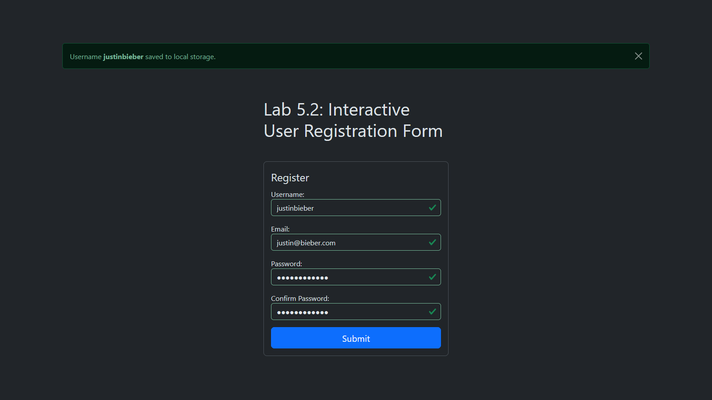

# Lab 5.2: Interactive User Registration Form

[Karl Johnson](https://github.com/hirekarl)  
2025-RTT-30  
<time datetime="2025-07-01">2025-07-01</time>  

## Overview
### Viewer Instructions
Navigate to  to view the deployed app; view the submission source below.

### Submission Source
- **HTML**: [`interactive-registration-form/index.html`](./interactive-registration-form/index.html)
- **JavaScript**: [`interactive-registration-form/script.js`](./interactive-registration-form/script.js)
- **CSS**: [`interactive-registration-form/styles.css`](./interactive-registration-form/styles.css)

### Reflection
1. How did `event.preventDefault()` help in handling form submission?
> `event.preventDefault()` prevented the page from reloading on submission, allowing me to display the "success" alert message upon succesful form submission. It also allowed me to handle my own custom validations prior to form submission, in the case of the check that the value of the "Confirm Password" field matches the value of the "Password" field.

2. What is the difference between using HTML5 validation attributes and JavaScript-based validation? Why might you use both?
> HTML5 validation validates form contents against given element attribute constraints, e.g. `minlength`, `pattern`, and `required`. When fields are not valid, the browser will focus the first invalid field and provide a default popup. JavaScript validation can work in tandem with HTML5 validation (i.e., in the case of `validity.typeMismatch` for `<input type="email">` or `validity.patternMismatch` for `<input type="password">` with a given regexp pattern) or with custom validation tests and `.setCustomValidity()`. I used both in my implementation: JavaScript handles the custom validity checks and messages; HTML5 validation takes over to focus and give a popup message when form submission is attempted with invalid fields.

3. Explain how you used localStorage to persist and retrieve the username. What are the limitations of localStorage for storing sensitive data?
> The first thing my script does upon `DOMContentLoaded` is to attempt to retrieve the `username` value stored in `localStorage` and, if it exists, set the value of the username input field to its value. When the (valid) form is successfully submitted, the value of `username` in `localStorage` is replaced with whatever value was submitted in the username input field through the form. `localStorage` is not appropriate for saving sensitive data like passwords, tokens, and API keys because there is no security, and malicious actors can easily gain access to the contents of a client's `localStorage`.

4. Describe a challenge you faced in implementing the real-time validation and how you solved it.
> I really wanted to implement Bootstrap's built-in form validation suite, but it took me a while to realize my implementation needed to match Bootstrap's "server-side validation" utilities. Instead of dealing with the `:valid` and `:invalid` pseudo-classes, I had to manually set and reset the `.is-valid` and `.is-invalid` classes Bootstrap provides. I also realized I wasn't getting the behavior I wanted on the password fields, so I put event listeners on `input`, `focus`, `blur`, and `change` events for both fields. I also realized I had to be strategic about the order of my `if` statements when validating: the most pertinent validation check (e.g., `validity.patternMismatch`) needs to come first, and the `validity.valueMissing` check needs to come last. I also had a hard time finding a Regexp for the password that worked, but in the end I modified one I found online and it does what I want after some tweaking.

5. How did you ensure that custom error messages were user-friendly and displayed at the appropriate times?
> Lots of testing and trial and error. Things seemed to work the most like what I expected when I put `blur` event handlers on the username and email fields and when I put `input`, `focus`, `blur`, and `change` event handlers on the password fields.

## Assignment Instructions
### Workplace Context
Imagine you’re a junior front-end developer at a startup. Your team is building a new web application, and your first task is to create the client-side functionality for the user registration page. It’s crucial that this form is user-friendly, provides clear validation feedback to prevent errors, and perhaps remembers some basic user input for convenience. This lab simulates that task, focusing on creating a responsive and interactive form.

## Attributions
